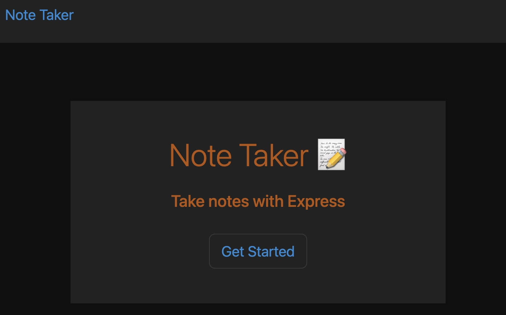
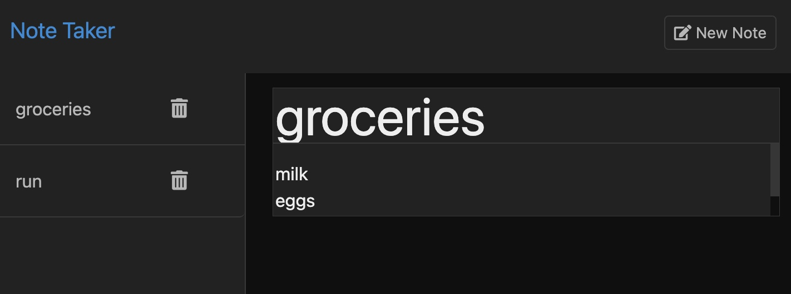

# Title:

Note Taker

## Table of Contents:

[Description](#description)

[Installation](#installation)

[User Information](#user-information)

[Questions](#questions)

[What I Learned](#what-i-learned)

[Code in index.js](#code-in-javascript)

[Dependencies](#dependencies)

[Link to live site](#link-to-live-site)

[Link to gitHub repo](#link-to-github-repository)

[Images of website functionality](#images-of-webpage-functionality)

[License](#license)

## Description:

This application will allow the user to take notes, save the note, and if desired, delete saved notes.

## Installation

To install this application please fork this repo. Then, run in terminal //~ npm init -y //~ npm i express //~ npm i uuid

This application has been launched through Heroku. However, if you wish to run this application locally run in terminal //~ npm start

## User Information

<a href='https://github.com/RaszeroT'> Travis Shanhun's github username: RaszeroT</a>

Email: shanhun.codes@gmail.com

## Questions

Please reach out to me if you have any further questions via:

Email: shanhun.codes@gmail.com

<a href='https://github.com/RaszeroT/note-taker'>Note Taker</a>

## What I learned:

In this application I experimented with async promises (async and await) instead of .then promises which I found easier for readability and also created cleaner/neater looking code.

## Code in JavaScript:

Server.js:

Routes to html files

note.js:

GET and POST requests to read current data and post to page, then delete data from db.json using the id

## Dependencies 

Express@4.17.1

uuid@9.0.1

nodemon@3.0.1 (this is for live updates while creating functions. This dependency is not necessary for running the application)

## Link to live site:

<a href="N/A">No live site to link</a>

## Video Tutorial:

<a href='https://drive.google.com/file/d/18Y1h9Pg3y08pBwvyCnB9jSr_9xll0bMP/view'>Video Tutorial</a>

## Example Images:

 
 
 

## License

MIT License

Copyright (c) 2023 RaszeroT

Permission is hereby granted, free of charge, to any person obtaining a copy
of this software and associated documentation files (the "Software"), to deal
in the Software without restriction, including without limitation the rights
to use, copy, modify, merge, publish, distribute, sublicense, and/or sell
copies of the Software, and to permit persons to whom the Software is
furnished to do so, subject to the following conditions:

The above copyright notice and this permission notice shall be included in all
copies or substantial portions of the Software.

THE SOFTWARE IS PROVIDED "AS IS", WITHOUT WARRANTY OF ANY KIND, EXPRESS OR
IMPLIED, INCLUDING BUT NOT LIMITED TO THE WARRANTIES OF MERCHANTABILITY,
FITNESS FOR A PARTICULAR PURPOSE AND NONINFRINGEMENT. IN NO EVENT SHALL THE
AUTHORS OR COPYRIGHT HOLDERS BE LIABLE FOR ANY CLAIM, DAMAGES OR OTHER
LIABILITY, WHETHER IN AN ACTION OF CONTRACT, TORT OR OTHERWISE, ARISING FROM,
OUT OF OR IN CONNECTION WITH THE SOFTWARE OR THE USE OR OTHER DEALINGS IN THE
SOFTWARE.